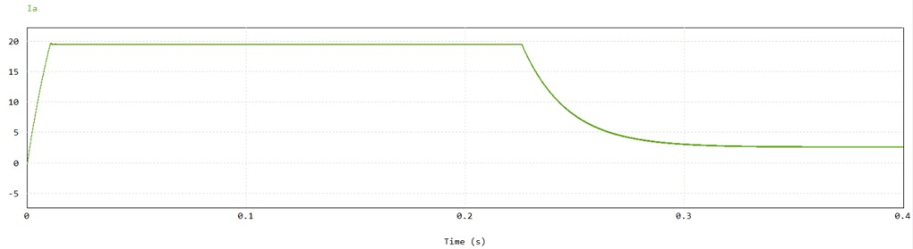
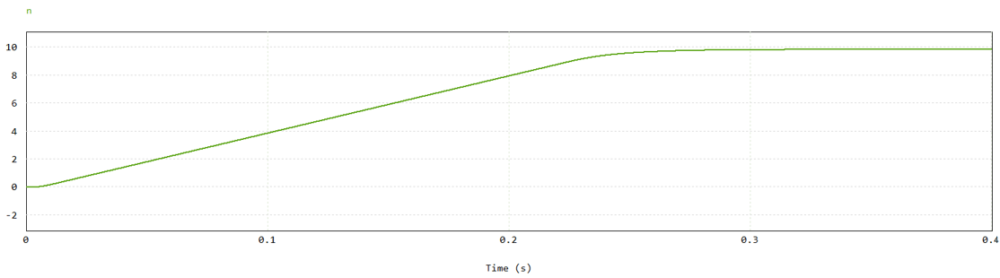
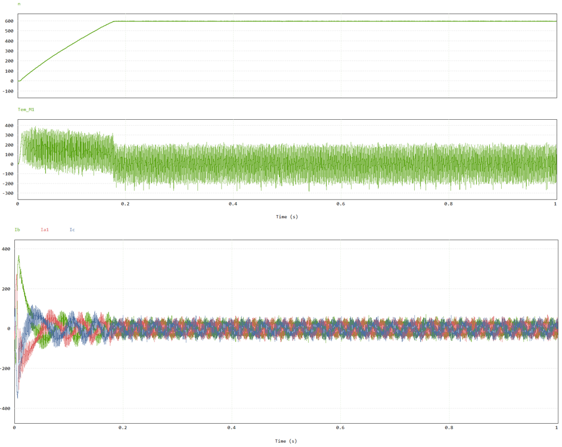
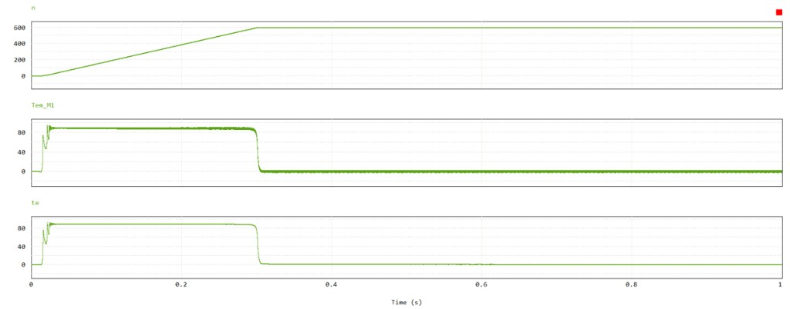

# 电机控制仿真

使用PSIM仿真软件进行建模与分析。

---

## 双闭环直流调速系统仿真实验

### 实验目的
- 熟悉PSIM仿真软件的使用
- 巩固单极性、双极性调制技术
- 巩固直流电机的双闭环控制原理
- 掌握PSIM控制的调试技巧

### 实验内容
- 直流电机PSIM仿真原理图的绘制
- 控制算法的CBlock模块设计
- 驱动电路的实现

### 仿真结果

#### 电流内环波形



**波形分析：**
- 启动阶段：电流快速上升并保持最大限幅值
- 加速阶段：电流维持限幅值使转速上升
- 稳态阶段：电流下降至保持转速稳定的数值

#### 转速外环波形



**波形分析：**
- 目标转速：10 rpm
- 实际结果：稳定在10 rpm
- 启动过程平稳，无明显超调

---

## 异步电机的直接转矩控制（DTC）

### 实验目的
- 巩固异步电机直接转矩控制理论
- 巩固异步电机的磁链观测算法
- 掌握多变量解耦控制策略

### 核心算法

#### 1. Clarke变换（三相电流转两相）
```c
isalfa = (2.0 * ia - ib - ic) / 3.0
isbeta = SQRT3 * (ib - ic) / 3.0
```

#### 2. 定子磁链观测器
```c
Fsalfa = Fsalfa + (usalfa - Rs * isalfa) * delt
Fsbeta = Fsbeta + (usbeta - Rs * isbeta) * delt
Flux = sqrt(Fsalfa * Fsalfa + Fsbeta * Fsbeta)
```

#### 3. 电磁转矩计算
```c
Te = 1.5 * pole_pairs * (Fsalfa * isbeta - Fsbeta * isalfa)
```

#### 4. 转速外环PI控制
```c
speed_err = speed_ref_rad - speed_rad
speed_int = speed_int + speed_err * delt
Te_ref_unsat = Kp_speed * speed_err + Ki_speed * speed_int
Te_ref = limit_value(Te_ref_unsat, Te_max, Te_min)
```

#### 5. 磁链滞环比较器
- Flux < Flux_ref - Flux_band → HF = 1（磁链偏小，需增加）
- Flux > Flux_ref + Flux_band → HF = -1（磁链偏大，需减小）
- 滞环内部 → HF保持

#### 6. 转矩滞环比较器
- Te_err > Te_band → HTe = 1（转矩偏小，需增加）
- Te_err < -Te_band → HTe = -1（转矩偏大，需减小）
- 滞环内部 → HTe = 0

#### 7. 空间电压矢量选择表
```c
DTCSVTable[6][6] =
{
    {2, 3, 4, 5, 6, 1},  // HTe=1, HF=1
    {0, 7, 0, 7, 0, 7},  // HTe=1, HF=0
    {6, 1, 2, 3, 4, 5},  // HTe=1, HF=-1
    {3, 4, 5, 6, 1, 2},  // HTe=0, HF=1
    {7, 0, 7, 0, 7, 0},  // HTe=0, HF=0
    {5, 6, 1, 2, 3, 4}   // HTe=0, HF=-1
};
```

### DTC仿真结果



**波形分析：**

| 时间段 | 现象 | 原因分析 |
|--------|------|----------|
| 0 ~ 0.02s | 转矩快速建立，波形大幅波动 | 初始磁链为0，磁链观测器开始积分，DTC选择增磁链、增转矩矢量，电流快速上升 |
| 0.02 ~ 0.18s | 转速从0上升到600 rpm | 速度误差大，速度PI输出的转矩给定基本饱和 |
| 约0.18s | 转速接近600 rpm | 速度误差变小，速度环把Te_ref降下来，转矩波形从偏正逐渐变成围绕0振荡 |
| 0.18 ~ 1s | 转速稳定在600 rpm | 速度环稳住，负载很小，平均电磁转矩接近0，但DTC造成明显转矩纹波 |

---

## 异步电机的矢量控制（FOC）

### 实验目的
- 巩固异步电机矢量控制理论
- 巩固坐标变换（Clarke变换、Park变换）
- 掌握转子磁场定向控制策略
- 理解SVPWM空间矢量调制原理

### 主要内容
1. **异步电机控制主电路** - 包括三相逆变器和电机本体
2. **坐标变换模块** - Clarke变换、Park变换及其逆变换
3. **转子磁链观测器** - 用于磁场定向
4. **电流环PI控制器** - d轴和q轴电流独立控制
5. **转速环PI控制器** - 外环速度控制
6. **SVPWM调制** - 空间矢量脉宽调制

### FOC仿真结果



**波形特征：**
- 转速：精确跟踪设定值，平滑过渡
- 转矩：响应快速，纹波小
- 电流：谐波含量低
- 磁链：圆形旋转磁场

---

## 四、DTC与FOC对比

| 特性 | 直接转矩控制(DTC) | 矢量控制(FOC) |
|------|-------------------|---------------|
| 控制目标 | 定子磁链 + 转矩 | 转子磁链 + 转矩 |
| 调制方式 | 滞环控制 + 查表 | SVPWM连续调制 |
| 响应速度 | 快速 | 较慢 |
| 转矩纹波 | 较大 | 较小 |
| 参数敏感性 | 对定子电阻敏感 | 对转子电阻敏感 |
| 实现复杂度 | 较低 | 较高 |
| 电流谐波 | 含量较高 | 含量较低 |

---

## 五、仿真参数参考

### 直接转矩控制参数
| 参数 | 典型值 |
|------|--------|
| 直流母线电压Udc | 600 V |
| 目标转速 | 600 rpm |
| 磁链滞环带宽 | 0.02 Wb |
| 转矩滞环带宽 | 5 N·m |
| 速度环Kp | 0.5 |
| 速度环Ki | 5.0 |

### 直流电机双闭环参数
| 参数 | 说明 |
|------|------|
| 目标转速 | 10 rpm |
| 调制方式 | 双极性调制 |

---

## 六、文件说明

| 文件名 | 说明 |
|--------|------|
| `DTC.psimsch` | 直接转矩控制仿真电路文件 |
| `FOC.psimsch` | 矢量控制仿真电路文件 |
| `Dual-closed-loop DC motor.psimsch` | 直流电机双闭环控制仿真电路 |
| `DTC.png` | DTC仿真结果波形图 |
| `FOC.png` | FOC仿真结果波形图 |
| `直流电机电流内环.png` | 直流电机电流内环波形 |
| `直流电机转速外环.png` | 直流电机转速外环波形 |
| `code` | cblock代码 |

---

